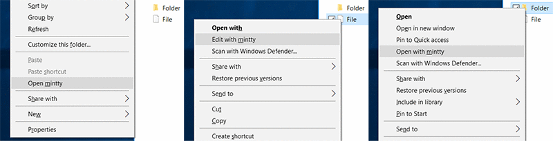

# Context menus for mintty (MSYS2)



Context menus for mintty lovers :computer::heart:

## Prerequisites

- Windows environment (Tested on Windows 10.0.10586.0)
- Install [MSYS2](https://msys2.github.io/)
- Install your favorite editor (ex: `pacman -Sy --needed vim`)
- Add MSYS2's path to `PATH` (ex: `C:\msys64\usr\bin`)
   - If entering `mintty` on cmd.exe runs mintty.exe, `PATH` have been correctly configured.

## Install and Uninstall

`install.reg` installs the following context menus:

- Edit with mintty (Context menu when right-clicking on file icon)
- Open with mintty (Context menu when right-clicking on directory icon)
- Open mintty (Context menu when right-clicking on directory background)

To uninstall the above menus, run `install.reg`.

## Choose your favorite editor 

You can change default editor by adding `export EDITOR=...` to your `~/.bashrc`:

```
export EDITOR=/usr/bin/nano
```

If not specified, `/usr/bin/vim -n`(Without swap file) is used for default
editor.

## Rebuild reg files (Requires Node.js)

`template` is a template file to write complex shell code briefly.
Edit `template` and run `node build.js`, then `install.reg` and `uninstall.reg` will
be updated. `template` must be saved in UTF-8 without BOM.

## References

- [Registering Shell Extension Handlers](https://msdn.microsoft.com/en-us/library/windows/desktop/cc144110%28v=vs.85%29.aspx)

## License

Distributed under the MIT license.

Copyright (C) 2016 Retorillo
